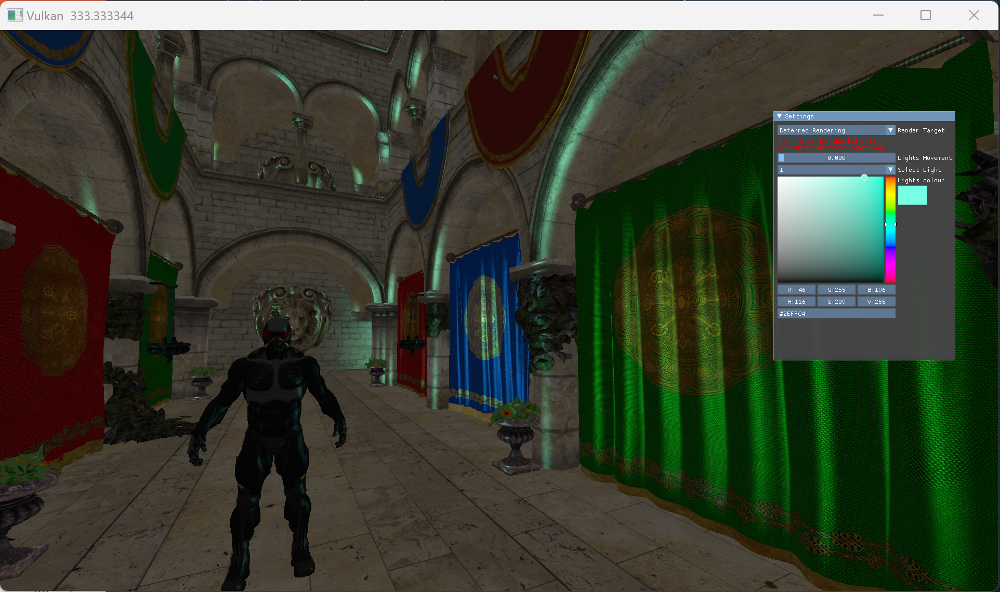
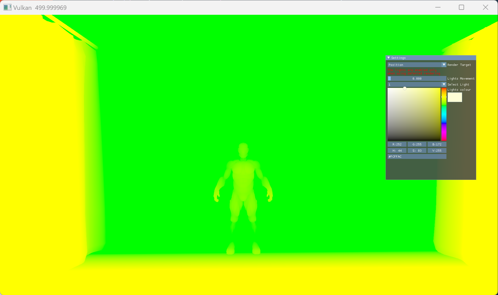

# Vulkan_learn
A dumb ass's vulkan learning project

The whole thing in this shit is based on the code provided by [vulkan-tutorial](https://vulkan-tutorial.com/Introduction).
I added some thing new like **vulkan memory allocator**, **complex model loading**, **Bling_Phong lighting**, **fog simulation** etc. However this renderer is still a trash, cuz I am new to C++ and vulkan. Maybe I will perfect it in the future after I know more about vulkan, or I totally forget it. That's all,bye bye.

